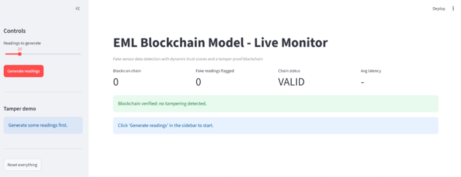
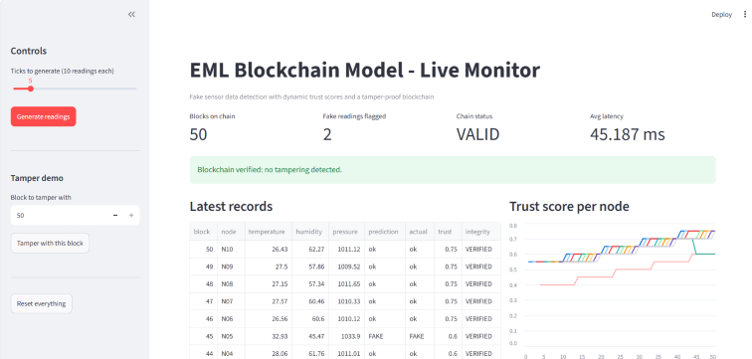
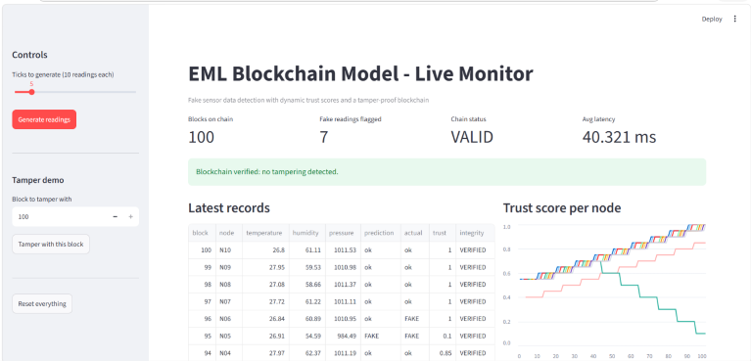
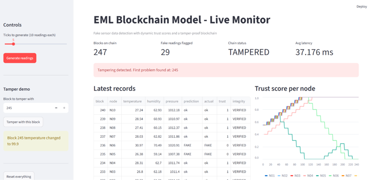

# ML - BLOCKCHAIN MODEL

Real-time implementation of the IEEE paper "Blockchain-Assisted Machine Learning Framework with Dynamic Trust Scoring for Secure Fake Sensor Data Detection and Tamper-Proof Data Integrity in IoT Networks". Sensor data is simulated.

## HOW IT WORKS 
1. 10 virtual sensor nodes generate readings (temperature, humidity, pressure). Some readings are fake (spoof, spike, drift, replay, stuck).
2. Preprocessing cleans each reading and builds features.
3. A Random Forest model predicts genuine or fake.
4. A dynamic trust score is updated for each node.
5. Every record is stored on a hash-linked blockchain (SHA-256).
6. Each record is verified, so any tampering is detected immediately.

## FOLDERS
- `detection/` - data generator, preprocessing, ML model and trust score (Person A)
- `blockchain/` - blockchain with SHA-256 hashing and tamper detection (Person B)
- `pipeline/` - real-time pipeline connecting all stages (Person B)
- `dashboard/` - live Streamlit dashboard (Person B)
- `screenshot/` - dashboard screenshots

## SETUP
    pip install -r requirements.txt

## RUN
    python blockchain/blockchain.py        (blockchain tamper tests)
    python pipeline/pipeline.py            (real-time pipeline, prints a summary)
    streamlit run dashboard/dashboard.py   (live dashboard with tamper demo)

## RETRAIN THE MODEL (Optional)
    cd detection
    python train_model.py

Note: This overwrites the saved model and graph files in the `detection` folder.

## Flow line

Sensors → Preprocessing → Random Forest → Trust score → Blockchain → Verification → Dashboard

## DASHBOARD

### Normal operation (chain status VALID)

### After tampering (chain status TAMPERED)
After a stored record is tampered with, the chain status turns TAMPERED and the changed block is flagged :

## RESULTS

### MACHINE LEARNING (test set, 2000 readings)
| Metrics | This work | Paper |
|---|---|---|
| Accuracy | 0.978 | 0.96 |
| Precision | 0.987 | 0.95 |
| Recall | 0.905 | 0.96 |
| F1-score | 0.944 | 0.955 |

### REAL TIME PIPELINE (100 ticks = 1000 readings)
- 147 of 165 fake readings detected, detection accuracy 0.975
- Tampered records: 0, chain valid: True
- Average time per reading: about 9 ms (ML + trust score + blockchain)

### BLOCKCHAIN TAMPER TESTS
All 4 attacks detected: edited value, deleted block, reordered blocks, deleted last block.

## LIMITATIONS
- Sensor data is simulated, not collected from physical IoT hardware.
- The blockchain runs on a single machine without distributed consensus.

## FUTURE WORK 
- Test the system on a real IoT testbed with physical sensors instead of simulated data.
- Replace the single-machine blockchain with a distributed platform (for example Ethereum or Hyperledger) with consensus.
- Improve recall on subtle attacks by testing other models and more features.
- Add continuous online learning so the model adapts to new attack patterns.

## Publication
This project is the real-time implementation of the paper:

**"Blockchain-Assisted Machine Learning Framework with Dynamic Trust Scoring for Secure Fake Sensor Data Detection and Tamper-Proof Data Integrity in IoT Networks"**

- Authors: [author names]
- Conference: ICOSICS 2026, [full conference name]
- Publisher: IEEE
- Status: [accepted / presented / published in IEEE Xplore]
- DOI / link: [add when available]
  
## TEAM
- Person A: Data collection, Preprocessing, ML model, Dynamic Trust score
- Person B: Blockchain, Pipeline, Dashboard
